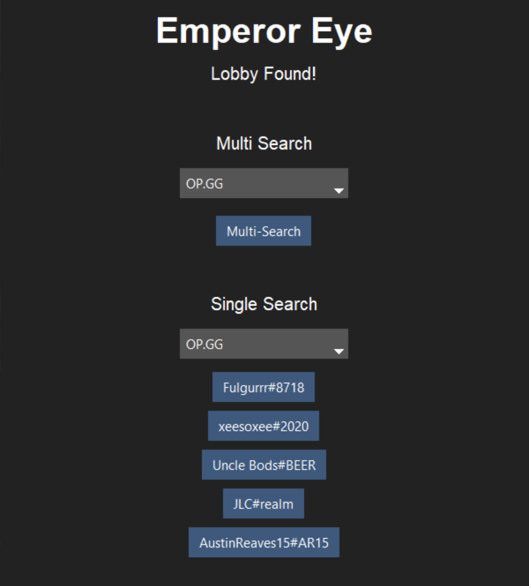

# Emperor Eye - Lobby Reveal

``Reveals Hidden Names During Champ Select``

## Table of Contents

- [Emperor Eye - Lobby Reveal](#emperor-eye---lobby-reveal)
- [Table of Contents](#table-of-contents)
- [Introduction](#introduction)
- [Features](#features)
- [Installation](#installation)
- [Usage](#usage)
- [Contributing](#contributing)
- [FAQ](#faq)

## Introduction

In the competitive world of League of Legends, the champion select phase presents a challenge: hidden names of allied players. Our solution, the Emperor Eye Program, unveils concealed names during this critical phase. It's a specialized tool that reveals hidden player identities, connecting users to third-party websites like OP.GG and U.GG. This integration equips players with comprehensive profiles and stats, empowering them to make informed decisions during champion selection.

The benefits are clear: access to hidden player names and third-party links offers insights into allies' playstyles and track records. Armed with this information, users can decide whether to proceed with a match or strategically dodge. Emperor Eye fosters a more informed and strategic gaming environment, allowing players to tailor their experience based on their preferences and expectations.

## Features

- Shows the Hidden Names
- Multi Search Using 3rd Party Websites (OP.gg & U.gg)
- Individual Search Functionality (OP.GG, U.gg, and etc.)

## Installation
Must follow the steps below

- Pre-requisites
  - Python 
  - Can run League of Legends
  - Any currently used Operating System
    - Windows
    - Mac
    - Linux
- Installation steps
  - Import necessary modules
    - lcu_driver
    - riotwatcher
    - requests
    - psutil
    - base64
    - tkinter 
    - ttkbootstrap
  - Hardest Part :skull:
      - Download Riot Client :skull:
      - Download League of Legends :skull:

## Usage

While League of Legends and Riot Client is running run ``main.py``

- Usage examples
  - Main Purpose is again Solo/Duo champ-select where names are hidden. However, it still can be used for any champ-select lobby
- API documentation
  - (Riot Client) https://riotclient.kebs.dev/#operation--GET%20/chat/v5/participants
  - (Riot Watcher) https://riot-watcher.readthedocs.io/en/latest/riotwatcher/LeagueOfLegends/index.html
  - (LCU) https://swagger.dysolix.dev/lcu/#/
- Screenshots

## Contributing

This project is generally for PH2, there are many things you could improve such as removing the GUI and focus on minimal and sleek design. If you want to improve this I suggest to start in ``core.py`` and go on from their.

- How to report issues
  - You can utilize github
- Questions?
  - Contact me
- Code of conduct
  - The more poeple who use this the more inclined RiotGames to fix the issue.

## FAQ
General ``Frequently Asked Questions``

- Can this get me banned?
  - No, but when you paste the names in chat and act like an asshole yes.
- Can I copy this and improve upon it?
  - Yes
- Will this work even after the new name changes?
  - Yes, in fact it was created for that purpose
- What OS does this work on? 
  - Works for Windows, Mac and Linux 
- Is this a virus?
  - No
- Will this delete system34?
  - No, you can check. There is only 5 python files.

